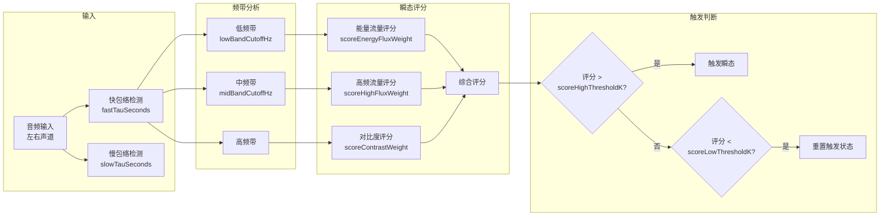
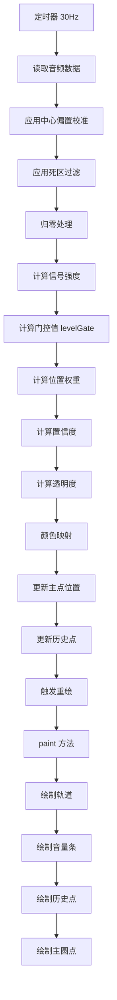

# SeePosition

<p align="center">
  
</p>

<p align="center">
  <strong>一款基于音频可视化定位的辅助工具</strong>
</p>

<p align="center">
  <a href="https://github.com/iisaacbeats/SeePosition/releases">下载最新版本</a> ·
  <a href="https://iisaacbeats.cn">官方网站</a> ·
  <a href="https://github.com/iisaacbeats/SeePosition/issues">报告问题</a>
</p>

## 📖 项目简介

SeePosition 是一款基于 JUCE 框架开发的桌面应用程序，专注于**立体声音频监控与可视化**。它可以将音频的声像位置（Balance）和立体声宽度（Width）实时可视化，帮助用户更直观地"看到"音频的空间特征。

### ✨ 主要特性

- 🎯 **实时音频监控** - 实时显示音频的声像位置和立体声宽度
- 🔍 **瞬态检测** - 自动检测并分类音频瞬态事件（枪声、脚步声、换弹）
- 📊 **可视化反馈** - 通过圆点位置和颜色直观显示音频特征
- ⚙️ **参数可调** - 丰富的调参选项，适配不同场景
- 🖥️ **WASAPI 环回捕获** - 支持 Windows 系统音频输出捕获

## 🚀 快速开始

### 系统要求

- Windows 10/11
- 支持 WASAPI 的音频设备

### 下载运行

从 [Releases](https://github.com/iisaacbeats/SeePosition/releases) 页面下载最新版本，解压后运行 `SeePosition.exe` 即可。

## 🏗️ 从源码构建

### 前置要求

- [CMake](https://cmake.org/download/) 3.22 或更高版本
- [Visual Studio 2022](https://visualstudio.microsoft.com/) 或更高版本（带 C++ 桌面开发工作负载）
- Git

### 构建步骤

```powershell
# 克隆仓库
git clone https://github.com/iisaacbeats/SeePosition.git
cd SeePosition

# 配置项目
cmake -S . -B build

# 编译项目
cmake --build build --config Release
```

编译完成后，可执行文件位于 `build/Release/SeePosition.exe`。

## 📊 音频处理与显示逻辑

### 整体架构流程图

```mermaid
flowchart TD
    subgraph 初始化
        A[MainComponent 构造函数] --> B[加载设置 loadSettings]
        B --> C[启动定时器 startTimerHz30]
        C --> D[设置窗口大小 760x90]
    end
    
    subgraph 音频捕获层["音频捕获层 (AudioCaptureService)"]
        E[音频输入] --> F[计算左右声道电平]
        F --> G[计算 Balance 和 Width]
        G --> H[瞬态检测算法]
        
        H --> H1[响度门限检测<br/>loudEnoughDb]
        H1 --> H2[起音对比分析<br/>onsetContrastStart]
        H2 --> H3[起音倍率分析<br/>onsetRatioStart]
        H3 --> H4[评分系统计算]
        
        H4 --> H5{评分 > 阈值?}
        H5 -->|是| H6[触发瞬态事件]
        H5 -->|否| H7[继续监听]
        H6 --> H8[瞬态分类]
    end
    
    subgraph 瞬态分类层["瞬态分类层"]
        H8 --> I1{分类判断}
        I1 -->|高频占比高+响度大| I2[枪声 Gunshot]
        I1 -->|换弹特征| I3[换弹 Reload]
        I1 -->|其他| I4[脚步声 Footstep]
    end
    
    subgraph 定时器回调["定时器回调 (30Hz)"]
        J[timerCallback 触发] --> K[获取音频数据]
        
        K --> L[rawBalance = getBalance]
        K --> M[targetWidth = getWidth]
        K --> N[targetLeft/RightLevel]
        
        L --> O[中心偏置校准]
        O --> P[targetBalance = rawBalance - centerBias]
        
        P --> Q{balance < deadzone?}
        Q -->|是| R[targetBalance = 0]
        Q -->|否| S[保持 targetBalance]
        R --> T[snapNearZero 处理]
        S --> T
        
        T --> U[计算 displaySignal]
        U --> V[计算 levelGate]
        V --> W[计算 positionWeight]
        W --> X[计算 confidence]
        X --> Y[计算 dotAlpha]
    end
    
    subgraph 历史点管理["历史点管理"]
        Z[popNextTransientEvent] --> Z1[创建 TransientDot]
        Z1 --> Z2[添加到 transientDots 数组]
        Z2 --> Z3[更新 ageSeconds]
        Z3 --> Z4{age > life?}
        Z4 -->|是| Z5[移除历史点]
        Z4 -->|否| Z6[保留历史点]
    end
    
    subgraph UI渲染层["UI渲染层 (paint)"]
        AA[paint 方法] --> AB[绘制背景]
        AB --> AC[绘制轨道 track]
        AC --> AD[绘制中心线与刻度]
        
        AD --> AE{显示侧边音量条?}
        AE -->|是| AF[绘制左右音量条]
        AE -->|否| AG[跳过音量条]
        
        AF --> AH[绘制历史点]
        AG --> AH
        
        AH --> AI{历史点类型?}
        AI -->|枪声| AJ[绘制圆形]
        AI -->|脚步| AK[绘制圆角矩形]
        AI -->|换弹| AL[绘制三角形]
        
        AJ --> AM[绘制主圆点]
        AK --> AM
        AL --> AM
        
        AM --> AN{鼠标悬停?}
        AN -->|是| AO[绘制设置按钮]
        AN -->|否| AP[仅显示轨道]
        AO --> AQ[绘制关闭按钮]
    end
    
    style 音频捕获层 fill:#e1f5ff
    style 瞬态分类层 fill:#fff3e1
    style 定时器回调 fill:#f0ffe1
    style 历史点管理 fill:#ffe1f5
    style UI渲染层 fill:#e1ffe8
```



### 音频处理详细流程



### 显示逻辑流程



### 可视化元素说明

| 元素 | 形状 | 含义 |
|------|------|------|
| 主圆点 | ● 圆形 | 当前音频的声像位置 |
| 历史点 - 枪声 | ● 圆形 | 检测到的枪声瞬态 |
| 历史点 - 脚步 | ▢ 圆角矩形 | 检测到的脚步声瞬态 |
| 历史点 - 换弹 | ▲ 三角形 | 检测到的换弹瞬态 |
| 侧边音量条 | ▬ 条形 | 左右声道电平显示 |

### 关键参数说明

| 参数类别 | 参数名 | 默认值 | 作用 |
|---------|--------|--------|------|
| **视觉调优** | `balanceDeadzone` | 0.03 | 声像死区，小于该值时主圆点归中 |
| | `centerBiasLearningRate` | 0.02 | 中心偏置学习率，静音时自动校正中心 |
| | `dotAlphaMin/Power` | 0.02/1.8 | 主点透明度范围和曲线 |
| **瞬态检测** | `loudEnoughDb` | -62.0 | 响度门限(dB) |
| | `onsetContrastStart` | 0.55 | 起音对比起始阈值 |
| | `scoreHighThresholdK` | 2.15 | 评分高阈值系数 |
| **瞬态分类** | `gunshotVeryLoudDb` | -30.0 | 枪声很响阈值 |
| | `gunshotBrightMin` | 0.38 | 枪声高频占比最小值 |

## 📁 项目结构

```
SeePosition/
├── Source/                          # 源代码目录
│   ├── MainComponent.cpp/h         # 主组件，UI 渲染和交互逻辑
│   ├── AudioCaptureService.cpp/h   # 音频捕获和处理服务
│   └── WasapiLoopbackCapture.cpp/h # Windows WASAPI 环回捕获
├── icon/                           # 图标资源
│   ├── icon.ico                    # 应用图标
│   └── icon.png                    # PNG 格式图标
├── CMakeLists.txt                  # CMake 构建配置
└── README.md                       # 项目说明文档
```

## 🔧 配置说明

软件提供丰富的可调参数，通过右键设置面板可以调整：

### 视觉调优参数
- **Balance Deadzone**: 声像死区范围
- **Center Bias Learning Rate**: 中心偏置学习速率
- **Dot Alpha**: 主点透明度设置
- **Colour Map**: 颜色映射范围

### 瞬态检测参数
- **Loudness Threshold**: 响度门限
- **Onset Contrast/Ratio**: 起音对比/倍率阈值
- **Score Weights**: 各评分项权重
- **Burst Detection**: 连发检测参数

## 📝 开源协议

本项目采用 **MIT 开源协议**。详见 [LICENSE](LICENSE) 文件。

```
MIT License

Copyright (c) 2024 iisaacbeats

Permission is hereby granted, free of charge, to any person obtaining a copy
of this software and associated documentation files (the "Software"), to deal
in the Software without restriction, including without limitation the rights
to use, copy, modify, merge, publish, distribute, sublicense, and/or sell
copies of the Software, and to permit persons to whom the Software is
furnished to do so, subject to the following conditions:

The above copyright notice and this permission notice shall be included in all
copies or substantial portions of the Software.

THE SOFTWARE IS PROVIDED "AS IS", WITHOUT WARRANTY OF ANY KIND, EXPRESS OR
IMPLIED, INCLUDING BUT NOT LIMITED TO THE WARRANTIES OF MERCHANTABILITY,
FITNESS FOR A PARTICULAR PURPOSE AND NONINFRINGEMENT. IN NO EVENT SHALL THE
AUTHORS OR COPYRIGHT HOLDERS BE LIABLE FOR ANY CLAIM, DAMAGES OR OTHER
LIABILITY, WHETHER IN AN ACTION OF CONTRACT, TORT OR OTHERWISE, ARISING FROM,
OUT OF OR IN CONNECTION WITH THE SOFTWARE OR THE USE OR OTHER DEALINGS IN THE
SOFTWARE.
```

## 🙏 致谢

- [JUCE](https://github.com/juce-framework/JUCE) - 强大的 C++ 音频框架

## 📧 联系方式

- 网站: [iisaacbeats.cn](https://iisaacbeats.cn)
- GitHub: [@sweetorange1](https://github.com/sweetorange1)

---

## 📦 上传文件清单

以下是将项目上传到 GitHub 时应包含的文件/目录：

### ✅ 必须上传的文件

```
SeePosition/
├── Source/                          # 源代码目录（必须）
│   ├── MainComponent.cpp           # 主组件实现
│   ├── MainComponent.h             # 主组件头文件
│   ├── AudioCaptureService.cpp      # 音频捕获服务实现
│   ├── AudioCaptureService.h       # 音频捕获服务头文件
│   ├── WasapiLoopbackCapture.cpp   # WASAPI 环回捕获实现
│   └── WasapiLoopbackCapture.h    # WASAPI 环回捕获头文件
├── icon/                           # 图标资源（必须）
│   ├── icon.ico                   # 应用图标（ICO 格式）
│   ├── icon.png                   # 应用图标（PNG 格式，用于 README）
│   └── resource.rc                # Windows 资源文件
├── CMakeLists.txt                  # CMake 构建配置（必须）
├── README.md                       # 项目说明文档（必须）
├── LICENSE                         # MIT 开源协议（必须）
└── .gitignore                      # Git 忽略文件（必须）
```

### ❌ 不应上传的文件/目录

以下文件/目录应添加到 `.gitignore` 中，不应上传到 GitHub：

```
# 构建目录
cmake-build-*/                     # CMake 构建目录
build/                             # 构建输出目录
out/                               # 输出目录
_Build/                            # 备用构建目录

# IDE 配置
.vscode/                           # VS Code 配置
.idea/                             # CLion 配置
*.swp                              # Vim 交换文件
*.swo

# JUCE 生成文件
JuceLibraryCode/                   # JUCE 自动生成的代码
JuceHeader.h                       # JUCE 自动生成的头文件
AppConfig.h                        # JUCE 自动生成的配置

# 依赖库（通过 CMake FetchContent 下载）
_deps/                             # CMake 下载的依赖

# 二进制文件
*.exe                              # 可执行文件
*.dll                              # 动态链接库
*.obj                              # 目标文件
*.pdb                              # 调试符号文件

# 用户设置
SeePosition.settings               # 用户设置文件
*.settings                         # 预设文件

# 临时文件
*.tmp
*.bak
*.backup
```

### 📋 上传前检查清单

- [ ] 确保 `Source/` 目录下所有 `.cpp` 和 `.h` 文件已添加详细中文注释
- [ ] 确保 `CMakeLists.txt` 配置正确
- [ ] 确保 `icon/` 目录包含图标文件
- [ ] 确保 `README.md` 内容完整（包含流程图）
- [ ] 确保 `LICENSE` 文件存在（MIT 协议）
- [ ] 确保 `.gitignore` 文件已创建并配置正确
- [ ] 删除所有构建目录（`cmake-build-*`, `build/`, `_Build/` 等）
- [ ] 删除 JUCE 生成的文件（`JuceLibraryCode/`, `JuceHeader.h` 等）

---

<p align="center">
  Made with ❤️ by sweetorange1
</p>
